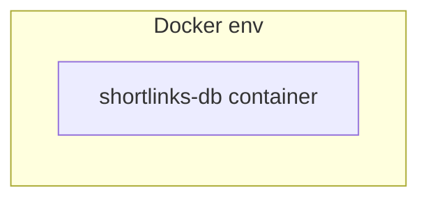
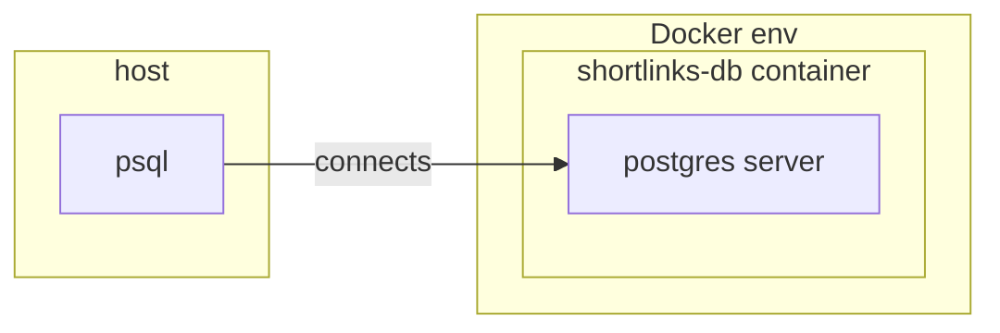
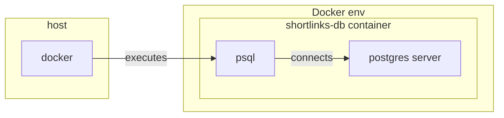
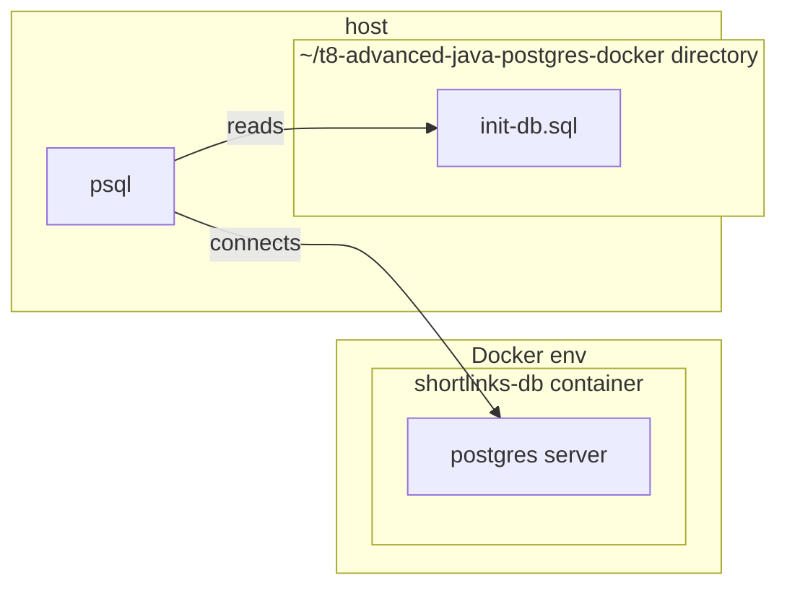
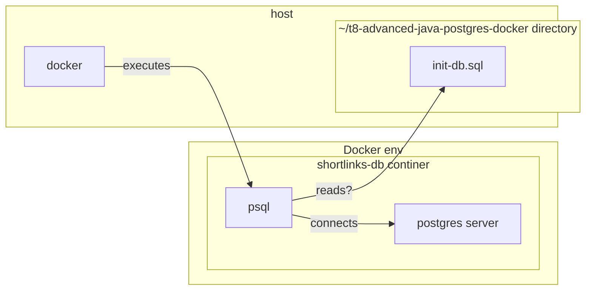
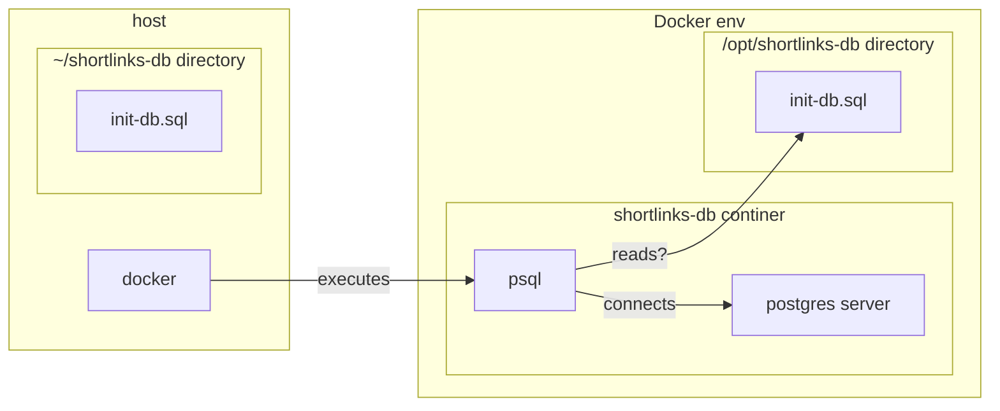

# Postgres in Docker

## Agenda
* Run postgres as a docker container
* Connect to postgres using psql
* Creating and querying tables
* Connect to Postgres using Database Navigator
* Connect to Postgres using pgAdmin
* Primary keys and indexes
* Automation

## Run Postgres
Although we can run postgres directly on our machines, we will use docker for the following reasons:
* Unified setup (Macos, Windows versions)
* We can easily spin multiple postgres instances when we work on different project
* We will likely use this setup in our production environment

### Starting container

```
docker run --name shortlinks-db --publish 5432:5432 --env POSTGRES_PASSWORD=mysecretpassword --detach postgres
```



### Interacting with containers

See that postgres is running:

```
docker ps
```

Check container logs:

```
docker logs shortlinks-db
```

Executing commands in the container:

```
docker exec -it shortlinks-db bash
```

Alternative: docker desktop.


## Connecting to Database

```
psql --host=localhost --username=postgres
```



Note that you can run `psql` in docker as well:
```
docker exec -it shortlinks-db psql --host=localhost --username=postgres
```



## Creating table
We need to create a table in order to use our database. Let's create `short_links` to store shortened URLs:

```sql
DROP TABLE IF EXISTS short_links;
CREATE TABLE short_links (
    key             varchar(8) NOT NULL PRIMARY KEY,
    original_url    varchar(1024) NOT NULL
);
```

Check that table created:

```
\d short_links
```


## Query table
```
SELECT * FROM short_links;
```

## Populate table

```
INSERT INTO short_links(key, original_url) VALUES
  ('wiki', 'https://en.wikipedia.org/wiki/Main_Page'),
  ('postgres', 'https://www.postgresql.org/docs/current/index.html');
```

Check that values populated:
```
SELECT * FROM short_links;
```

How to fetch a specific link?

## Alternative ways to work with postgres

### Database navigator plugin

https://plugins.jetbrains.com/plugin/1800-database-navigator

### pgAdmin

https://www.pgadmin.org/


## Primary keys and indexes

### Why we need to set primary key?
* Primary key values are unique;
* Query speed.

```
EXPAIN SELECT * FROM short_links WHERE key='wiki'
```

Let's add another column:
```
ALTER TABLE short_links ADD COLUMN user_id INT;
```

```

INSERT INTO short_links(key, original_url, user_id) VALUES
  ('wiki', 'https://en.wikipedia.org/wiki/Main_Page', 1),
  ('redi', 'https://www.redi-school.org/', 2);
```


Let's add an index:

```
CREATE INDEX user_id_idx ON short_links(user_id);
```

```
SET enable_seqscan = OFF;
EXPAIN SELECT * FROM short_links WHERE user_id=1;
```


From https://en.wikipedia.org/wiki/Library_catalog


## Automate things
We can apply an SQL script in a batch mode:
```
psql --host=localhost --username=postgres --file init-db.sql
```



### Can we do it in Docker?
```
docker exec -it shortlinks-db psql --host=localhost --username=postgres --file init-db.sql
```



Let's mount the current directory:
```
docker run --name shortlinks-db --publish 5432:5432 --env POSTGRES_PASSWORD=mysecretpassword --detach --volume /Users/kimk/repos/redi/t8-advanced-java-postgres-docker:/opt/shortlinks-db postgres
```


```
docker exec -it shortlinks-db bash
```

Execute SQL script:
```
docker exec -it shortlinks-db psql --host=localhost --username=postgres --file /opt/shortlinks-db/init-db.sql
```

Read more about mounts: https://docs.docker.com/storage/bind-mounts/



## Homework
* Dump `short_links` table rows into local disc
